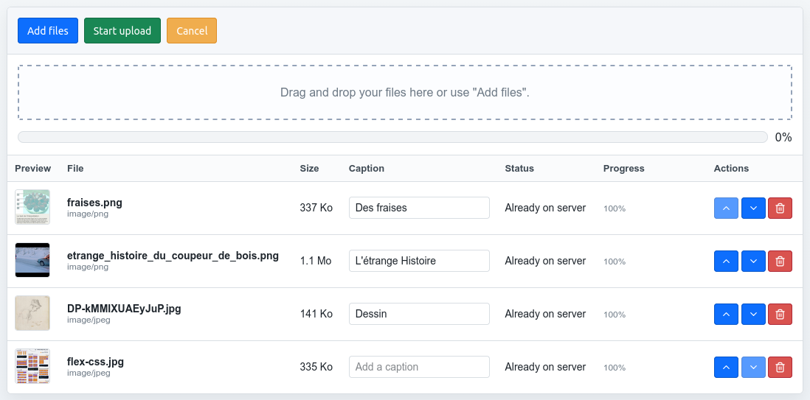

# Upload Manager

A lightweight file-uploader widget for the web — a modern, framework-agnostic alternative to Blueimp's jQuery File Upload. Built with [Svelte 5](https://svelte.dev) (compiled to a custom element) on top of [Uppy](https://uppy.io), and shipped as ready-to-use ES/UMD bundles.

It provides drag-and-drop uploads, a file table with previews and progress bars, reordering, per-file captions, and a list of files already stored on the server — all driven by a simple HTTP contract you implement on the backend.



## Features

- Drag-and-drop or file-picker uploads (single or multiple files).
- Live progress bars and per-file status.
- Image previews (thumbnails) for local and remote files.
- Remote file listing: shows files already stored on the server alongside pending uploads.
- Reordering (move up / down) for both local and remote files, with optional server persistence.
- Editable per-file captions persisted to the server.
- File size restriction.
- Built-in i18n (English default, French included), custom locale packs, and per-key label overrides.
- Event callbacks for every lifecycle step.
- No framework required on the host page — it registers a `<upload-manager>` custom element.

## Installation

Install from npm:

```bash
npm install @ilhooq/upload-manager
```

For local development in this repository:

```bash
npm install
npm run build   # produces dist/ (ES + UMD bundles + style.css)
```

The build outputs:

| File | Description |
| --- | --- |
| `dist/upload-manager.es.js` | ES module bundle (`import`) |
| `dist/upload-manager.umd.js` | UMD bundle (`require` / `<script>`) |
| `dist/upload-manager.css` | Stylesheet (import or `<link>`) |

`package.json` exposes these through the `exports` map, so consumers can do:

```js
import { UploaderWidget } from "@ilhooq/upload-manager"
import "@ilhooq/upload-manager/style.css"
```

## Quick start

```html
<link rel="stylesheet" href="/dist/upload-manager.css">
<div id="uploader"></div>

<script type="module">
  import { UploaderWidget } from "/dist/upload-manager.es.js"

  const widget = new UploaderWidget("#uploader", {
    endpoint: "/api/files",        // POST  — upload
    listEndpoint: "/api/files",    // GET   — list existing files
    updateEndpoint: "/api/files",  // PATCH — update caption / order
    deleteEndpoint: "/api/files",  // DELETE?id=... — remove a file
    fieldName: "file",
    maxFileSize: 5 * 1024 * 1024,
    locale: "en",
    onUploadSuccess: ({ file, serverId }) => {
      console.log("uploaded", file.name, "->", serverId)
    }
  })
</script>
```

All four endpoints may point to the same URL and dispatch by HTTP method (see the PHP reference in `example/app.php`).

## Running the example

The repository ships with a complete PHP reference backend.

```bash
npm run backend   # PHP built-in server on localhost:8081 (serves example/app.php)
npm run dev       # Vite dev server, opens example/index-dev.html (uses src/ directly)
```

Both processes must run together: the Vite dev server proxies `/example/app.php` to the PHP server. `index-dev.html` imports the widget straight from source (no build step needed); `index.html` uses the built `dist/` artifacts.

## API

The library exposes two layers:

- **`UploaderWidget`** — the public entry point. Mounts the UI into a DOM element, wires options to the core, and bridges events to callbacks. This is what most consumers use.
- **`UploaderCore`** — the framework-agnostic engine that owns all state and network calls. Use it directly if you want to build your own UI or integrate with another framework.

### Exports

```js
import {
  UploaderWidget,           // public widget class
  UploaderCore,             // headless engine
  DEFAULT_OPTIONS,          // default option values
  DEFAULT_LABELS,           // default locale's string set
  resolveLocale,            // (locale, labels) => { strings, pluralize }
  formatBytes,              // (bytes) => human-readable string
  locales, DEFAULT_LOCALE,  // locale registry + default key ("en")
  fr, en                    // individual locale packs
} from "@ilhooq/upload-manager"
```

`UploaderWidget` is also assigned to `window.UploaderWidget` for non-module usage.

---

### `new UploaderWidget(target, options)`

Creates and mounts the widget.

- `target` — a CSS selector string or a DOM element. Throws if the target cannot be found.
- `options` — see [Options](#options) below. Callbacks may be passed either at the top level (`onReady`, `onUploadSuccess`, …) or nested under `options.callbacks`.

Construction immediately mounts the `<upload-manager>` element and calls `core.init()` (which loads remote files if `showRemoteFiles` is enabled).

#### Options

| Option | Type | Default | Description |
| --- | --- | --- | --- |
| `endpoint` | string | `"./app.php"` | URL for the `POST` upload request. |
| `listEndpoint` | string | `"./app.php"` | URL for the `GET` listing of remote files. |
| `updateEndpoint` | string | `"./app.php"` | URL for the `PATCH` update (caption / order). Falls back to `orderEndpoint` if not set. |
| `deleteEndpoint` | string | `"./app.php"` | URL for the `DELETE` request (`?id=<id>`). |
| `orderEndpoint` | string | `"./app.php"` | Legacy alias used as fallback for `updateEndpoint`. |
| `fieldName` | string | `"file"` | Multipart form field name for the uploaded file. |
| `maxFileSize` | number | `5242880` (5 MB) | Maximum size per file, in bytes. |
| `autoProceed` | boolean | `false` | Start uploading as soon as files are added. |
| `multiple` | boolean | `true` | Allow more than one file (`false` limits to 1). |
| `showRemoteFiles` | boolean | `true` | Fetch and display files already on the server. |
| `persistOrder` | boolean | `true` | Persist remote reordering to the server via `PATCH`. |
| `locale` | string \| object | `"en"` | Locale key (`"en"`, `"fr"`), or a custom `{ strings, pluralize }` pack. |
| `labels` | object | `{}` | Per-key string overrides applied on top of the chosen locale. |

#### Methods

| Method | Description |
| --- | --- |
| `getState()` | Returns the current [state object](#state-object). |
| `addFiles(files)` | Adds an array of `File`/`Blob` objects to the upload queue. |
| `startUpload()` | Async. Uploads all pending files. |
| `cancelAll()` | Cancels all in-progress uploads. |
| `reload()` | Async. Re-fetches the remote file list. |
| `removeLocalById(id)` | Async. Removes a local file by its Uppy id (deletes from server too if already uploaded). |
| `removeRemoteById(id)` | Async. Deletes a remote file by its server id. |
| `destroy()` | Tears down the widget: unsubscribes events, closes Uppy, revokes preview URLs, empties the target. |

#### Callbacks

Each callback receives a single object argument that always contains `widget` (the `UploaderWidget` instance) and `state` (the current state), plus event-specific fields.

| Callback | Payload (besides `widget`, `state`) | Fired when |
| --- | --- | --- |
| `onReady` | — | The core has initialized (remote files loaded). |
| `onChange` | — | Any state change (progress, add, remove, reorder…). |
| `onUploadSuccess` | `file`, `response`, `serverId` | A file finished uploading. |
| `onUploadError` | `file`, `error`, `response` | An upload failed. |
| `onFileUpdate` | `id`, `changes`, `file` | A `PATCH` update (caption/order) succeeded. |
| `onFileUpdateError` | `id`, `changes`, `error` | A `PATCH` update failed. |
| `onReorder` | `scope` (`"local"`/`"remote"`), `id`, `direction` (`"up"`/`"down"`), `order`, `persisted`, `error?` | A file was moved. |
| `onDeleteSuccess` | `id`, `scope` | A file was removed. |
| `onDeleteError` | `id`, `scope`, `error` | A removal failed. |

---

### `new UploaderCore(options)`

The headless engine. Accepts the same `options` as the widget (minus callbacks). Use it to drive a custom UI.

```js
const core = new UploaderCore({ endpoint: "/api/files" })
const unsubscribe = core.subscribe((state) => render(state))
await core.init()
```

#### State subscription vs. event bus

The core exposes two distinct notification channels:

- **`subscribe(listener)`** — calls `listener(state)` immediately and on **every** state change. Returns an unsubscribe function. Use it to render the full UI.
- **`on(eventName, listener)`** — subscribes to a named domain event. Returns an unsubscribe function. Events: `ready`, `change`, `uploadSuccess`, `uploadError`, `fileUpdate`, `fileUpdateError`, `reorder`, `deleteSuccess`, `deleteError`. (`UploaderWidget` bridges these to the `on*` callbacks above.)

#### Methods

| Method | Description |
| --- | --- |
| `init()` | Async. Loads remote files (if enabled), emits `ready`, notifies subscribers. |
| `getState()` | Returns the current [state object](#state-object). |
| `subscribe(listener)` | Subscribe to full-state changes. Returns unsubscribe fn. |
| `on(event, listener)` | Subscribe to a named event. Returns unsubscribe fn. |
| `addFiles(files)` | Add files to the Uppy queue. |
| `startUpload()` | Async. Upload pending files. |
| `cancelAll()` | Cancel all uploads. |
| `moveLocal(id, direction)` | Reorder a local file (`"up"` / `"down"`). |
| `moveRemote(id, direction)` | Async. Reorder a remote file; persists via `PATCH` when `persistOrder` is on, rolling back on failure. |
| `removeLocalById(id)` | Async. Remove a local file (and its server copy if uploaded). |
| `removeRemoteById(id)` | Async. Delete a remote file. |
| `saveRemoteCaption(id, caption)` | Async. Persist a caption via `PATCH` (no-op if unchanged). |
| `reload()` | Async. Re-fetch the remote file list. |
| `t(key, vars)` | Translate a locale key with `%{var}` interpolation and pluralization. |
| `destroy()` | Tear down: close Uppy, revoke previews, clear listeners. |

#### State object

`getState()` and every subscriber/callback receive:

```js
{
  localFiles: [ /* ordered Uppy file objects (pending or uploading) */ ],
  remoteFiles: [ /* ordered remote file descriptors from the server */ ],
  counts: { local: Number, remote: Number },
  progress: Number   // 0–100, overall upload progress of local files
}
```

> **Local vs. remote files are two independent ordered lists.** `localFiles` are files in Uppy; `remoteFiles` are fetched from `listEndpoint`. On upload success, a file is promoted into the remote list (when `showRemoteFiles` is on) so it renders identically to files already on the server.

---

### Helpers

- **`resolveLocale(locale, labels)`** → `{ strings, pluralize }`. Merges `default pack → chosen pack → labels`. Accepts a known key, a full/partial pack object.
- **`formatBytes(bytes)`** → human-readable size string (e.g. `"1.5 Mo"`). Returns `"-"` for non-positive/invalid input.

## Internationalization (i18n)

UI strings live in locale packs under `src/locales/` (`en.js`, `fr.js`). Each pack is:

```js
export default {
  pluralize: (n) => (n === 1 ? 0 : 1),
  strings: { addFiles: "Add files", /* … */ }
}
```

The `locale` option accepts:

- a known key — `locale: "fr"`
- a custom pack — `locale: { strings: {...}, pluralize: (n) => ... }`
- a partial pack (missing keys fall back to the default locale)

The legacy `labels` option overrides individual keys on top of the resolved locale:

```js
new UploaderWidget("#uploader", {
  locale: "fr",
  labels: { addFiles: "Choisir des fichiers" }
})
```

Plural strings are objects keyed by `pluralize(count)`; pass `count` in `vars` when translating. Strings support `%{var}` interpolation (e.g. `previewAlt: "Preview of %{name}"`).

## Server contract

You implement four endpoints (which may share one URL, dispatching by HTTP method). `example/app.php` is a complete reference implementation that persists ordering and captions in `example/uploads/.meta.json` and sanitizes/de-duplicates uploaded file names.

### `GET listEndpoint` — list remote files

```json
{
  "files": [
    {
      "id": "photo.jpg",
      "name": "photo.jpg",
      "size": 12345,
      "type": "image/jpeg",
      "url": "uploads/photo.jpg",
      "caption": "optional",
      "order": 1
    }
  ]
}
```

Recognized fields: `id`, `name`, `size`, `type`, `url`, `caption?`, `order?` (1-based), plus any extra scalar fields (e.g. `thumbUrl`, `updatedAt`).

### `POST endpoint` — upload (multipart)

Field name from the `fieldName` option. Response:

```json
{
  "id": "photo.jpg",
  "file": { "id": "photo.jpg", "name": "photo.jpg", "url": "uploads/photo.jpg", "...": "..." }
}
```

The server id extracted by the client is `response.body.id` or `response.body.file.id`.

### `PATCH updateEndpoint` — update caption / order

Request body:

```json
{ "id": "photo.jpg", "changes": { "order": 2 } }
```

`order` is 1-based. Response:

```json
{ "id": "photo.jpg", "file": { "...": "..." } }
```

### `DELETE deleteEndpoint?id=<id>` — remove a file

```json
{ "deleted": "photo.jpg" }
```

Non-2xx responses should return `{ "error": "message" }`, which the client surfaces in the thrown error.

## Architecture

Three layers, with strict boundaries:

1. **`src/core/uploader-core.js`** (`UploaderCore`) — owns all state and side effects (Uppy instance, remote list, ordering, preview URLs, network requests). Framework-agnostic, no DOM.
2. **`src/ui/UploaderElement.svelte`** — Svelte 5 component compiled to the `<upload-manager>` custom element (`shadow: "none"`). Receives the core via a `core` prop and re-renders on `core.subscribe(...)`.
3. **`src/adapters/widget.js`** (`UploaderWidget`) — public entry point. Wires options to the core, mounts the element, bridges core events to user callbacks, and registers the custom element tag once.

When changing behavior: state/network → core; rendering → Svelte component; option/callback shape → adapter.

## Scripts

| Command | Description |
| --- | --- |
| `npm run dev` | Vite dev server (opens `example/index-dev.html`, uses `src/`). |
| `npm run backend` | PHP built-in server on `localhost:8081` serving `example/app.php`. |
| `npm run build` | Library build into `dist/` (ES + UMD + single CSS). |
| `npm run preview` | Serve the built `dist/` output. |

No test suite, linter, or typecheck is configured.
